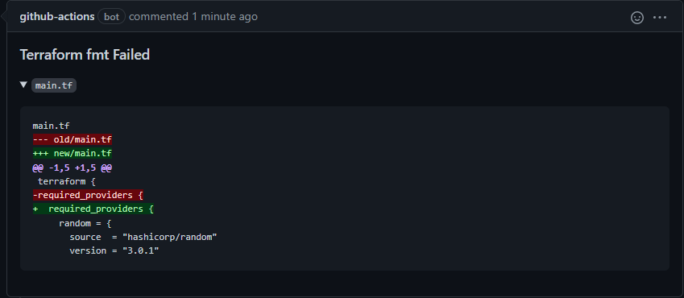

# Terraform Format (fmt) action

This is one of a suite of terraform related actions.

This action uses the `terraform fmt` command to check that all terraform files in a terraform configuration directory are in the canonical format.
This can be used to check that files are properly formatted before merging.

If any files are not correctly formatted, the GitHub Action job failed.

A comment can be added to the pull request in case of error related to the `terraform fmt` command.

## Requirements

* This GitHub Actions does not install `terraform`, so you have to install them in advanced.

  ```yaml
  - name: Setup Terraform
    uses: hashicorp/setup-terraform@v2
    with:
      terraform_wrapper: false
  ```

## Inputs

* `target`

  By default, fmt scans the current directory for configuration files. If you provide a file or a directory for the `target` argument, then fmt will scan that file or that directory instead. 
 
  - Type: string
  - Optional
  - Default: The current directory

  ```yaml
  with:
    target: ./modules
  ```

* `check`
    
  By default, fmt checks if the input is properly formatted. If you set it to false, code will be formated in a canonical format.

  - Type: boolean
  - Optional
  - Default: true
 
* `recursive`

  Process files in subdirectories. By default, all subdirectories are process.

  - Type: boolean
  - Optional
  - Default: true

  ```yaml
  with:
    recursive: false
  ```

* `comment`

  Whether or not to comment on GitHub pull requests.

  - Type: boolean
  - Optional
  - Default: false

  ```yaml
  with:
    comment: true
  ```

## Outputs

* `exitcode`

  The exit code of the Terraform fmt command. 

* `output`

  The Terraform fmt output. 

## Environment Variables

* `GITHUB_TOKEN`

  The GitHub authorization token to use to add a comment to a PR. 
  The token provided by GitHub Actions can be used - it can be passed by
  using the `${{ secrets.GITHUB_TOKEN }}` expression, e.g.

  ```yaml
  env:
    GITHUB_TOKEN: ${{ secrets.GITHUB_TOKEN }}
  ```

  The token provided by GitHub Actions will work with the default permissions.
  The minimum permissions are `pull-requests: write`.
  It will also likely need `contents: read` so the job can checkout the repo.

## Example usage

This example workflow runs on pull request and fails if any of the terraform files are not formatted correctly.

```yaml
name: Check terraform file formatting

on:
  pull_request:

permissions:
  contents: read
  pull-requests: write

jobs:
  TerraformFormat:
    runs-on: ubuntu-latest
    name: Check terraform file formatting
    env:
      GITHUB_TOKEN: ${{ secrets.GITHUB_TOKEN }}
    steps:

      - name: Setup Terraform
        uses: hashicorp/setup-terraform@v2
        with:
          terraform_wrapper: false

      - name: Checkout
        uses: actions/checkout@v3

      - name: terraform fmt
        id: fmt
        uses: benyboy84/GitHubAction_terraform-fmt@v1
        with:
          target: ./modules
          recursive: false
          comment: true
```

## Screenshots

